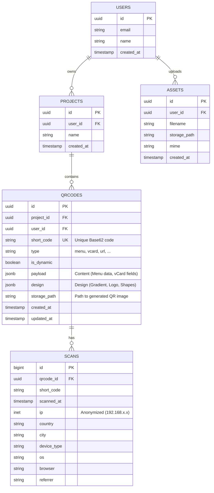

# Database Schema Design

## ER Diagram (Mermaid)



## SQL Schema Definition (PostgreSQL)

```sql
-- Enable UUID extension
CREATE EXTENSION IF NOT EXISTS "uuid-ossp";

-- USERS Table
CREATE TABLE users (
    id uuid PRIMARY KEY DEFAULT uuid_generate_v4(),
    email text UNIQUE NOT NULL,
    name text,
    created_at timestamptz DEFAULT now()
);

-- PROJECTS Table
CREATE TABLE projects (
    id uuid PRIMARY KEY DEFAULT uuid_generate_v4(),
    user_id uuid REFERENCES users(id) ON DELETE CASCADE,
    name text NOT NULL,
    created_at timestamptz DEFAULT now()
);

-- QRCODES Table
CREATE TABLE qrcodes (
    id uuid PRIMARY KEY DEFAULT uuid_generate_v4(),
    user_id uuid REFERENCES users(id) ON DELETE SET NULL,
    project_id uuid REFERENCES projects(id) ON DELETE CASCADE,
    short_code text UNIQUE,
    type text NOT NULL, 
    is_dynamic boolean DEFAULT false,
    payload jsonb NOT NULL DEFAULT '{}',
    design jsonb NOT NULL DEFAULT '{}',
    storage_path text,
    created_at timestamptz DEFAULT now(),
    updated_at timestamptz DEFAULT now()
);

-- SCANS Table (Analytics)
CREATE TABLE scans (
    id bigserial PRIMARY KEY,
    qrcode_id uuid REFERENCES qrcodes(id) ON DELETE SET NULL,
    short_code text, -- Denormalized for speed
    scanned_at timestamptz DEFAULT now(),
    ip inet,         -- Anonymized IP
    country text,
    city text,
    device_type text,
    os text,
    browser text,
    referrer text,
    meta jsonb       -- Extra data
);

-- ASSETS Table
CREATE TABLE assets (
    id uuid PRIMARY KEY DEFAULT uuid_generate_v4(),
    user_id uuid REFERENCES users(id) ON DELETE CASCADE,
    filename text,
    storage_path text NOT NULL,
    mime text,
    size_bytes bigint,
    created_at timestamptz DEFAULT now()
);

-- Indexes
CREATE INDEX idx_qrcodes_short_code ON qrcodes(short_code);
CREATE INDEX idx_scans_qrcode_id_scanned_at ON scans(qrcode_id, scanned_at);
```

## JSONB Structures Example

### `design` Column
```json
{
  "dotsOptions": {
    "type": "rounded",
    "color": "#4a90e2",
    "gradient": {
      "type": "linear",
      "rotation": 45,
      "colorStops": [{ "offset": 0, "color": "#4a90e2" }, { "offset": 1, "color": "#9013fe" }]
    }
  },
  "cornersSquareOptions": { "type": "extra-rounded" },
  "cornersDotOptions": { "type": "dot" },
  "backgroundOptions": { "color": "#ffffff" },
  "imageOptions": { "crossOrigin": "anonymous", "margin": 10 }
}
```
