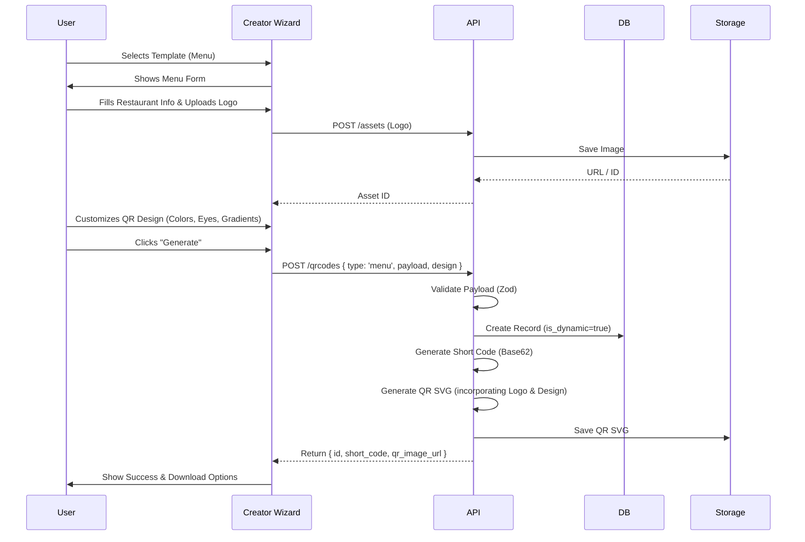
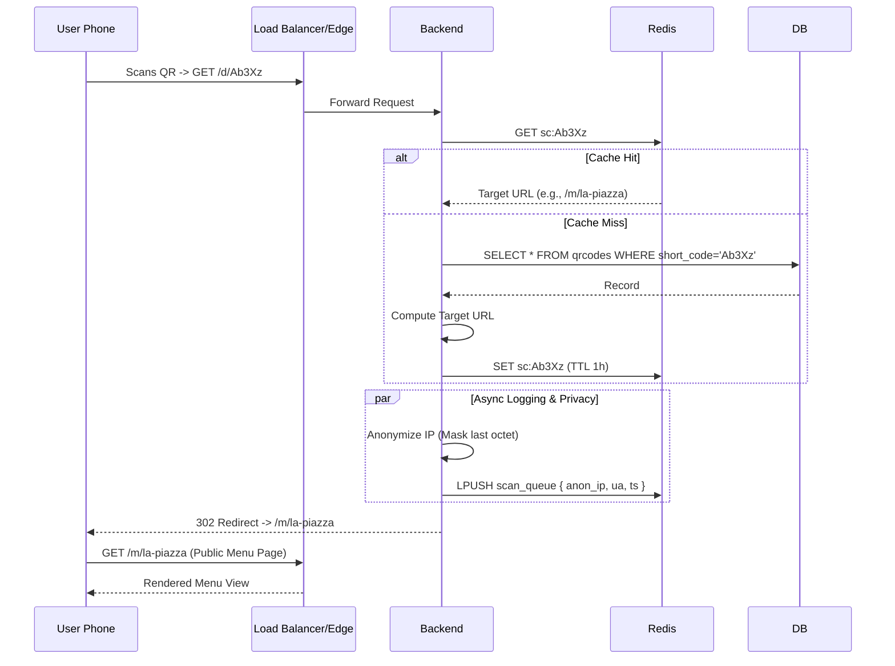

# Flow Diagrams

## 1. QR Creation Flow (User Journey)

```mermaid
sequenceDiagram
    participant User
    participant UI as Creator Wizard
    participant API
    participant DB
    participant S3 as Storage

    User->>UI: Selects Template (Menu)
    UI->>User: Shows Menu Form
    User->>UI: Fills Restaurant Info & Uploads Logo
    UI->>API: POST /assets (Logo)
    API->>S3: Save Image
    S3-->>API: URL / ID
    API-->>UI: Asset ID
    
    User->>UI: Customizes QR Design (Colors, Eyes, Gradients)
    User->>UI: Clicks "Generate"
    UI->>API: POST /qrcodes { type: 'menu', payload, design }
    
    API->>API: Validate Payload (Zod)
    API->>DB: Create Record (is_dynamic=true)
    API->>API: Generate Short Code (Base62)
    API->>API: Generate QR SVG (incorporating Logo & Design)
    API->>S3: Save QR SVG
    API-->>UI: Return { id, short_code, qr_image_url }
    
    UI->>User: Show Success & Download Options
```

## 2. Scan & Redirect Flow (End User)

```mermaid
sequenceDiagram
    participant Phone as User Phone
    participant Edge as Load Balancer/Edge
    participant API as Backend
    participant Redis
    participant DB

    Phone->>Edge: Scans QR -> GET /d/Ab3Xz
    Edge->>API: Forward Request
    
    API->>Redis: GET sc:Ab3Xz
    alt Cache Hit
        Redis-->>API: Target URL (e.g., /m/la-piazza)
    else Cache Miss
        API->>DB: SELECT * FROM qrcodes WHERE short_code='Ab3Xz'
        DB-->>API: Record
        API->>API: Compute Target URL
        API->>Redis: SET sc:Ab3Xz (TTL 1h)
    end

    par Async Logging & Privacy
        API->>API: Anonymize IP (Mask last octet)
        API->>Redis: LPUSH scan_queue { anon_ip, ua, ts }
    end

    API-->>Phone: 302 Redirect -> /m/la-piazza
    Phone->>Edge: GET /m/la-piazza (Public Menu Page)
    Edge-->>Phone: Rendered Menu View
```
